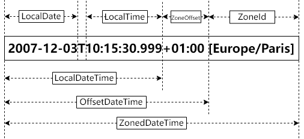

<!--truncate-->

`LocalDateTime`类是不包含时区信息的，可以通过`atZone`方法来设置`ZoneId`，返回`ZonedDateTime`类实例，通过`atOffset`方法来设置`ZoneOffset`，返回`OffsetDateTime`类实例。



## ZonedDateTime 类注释详解

我们来逐段解读一下 ZonedDateTime 类的注释。

> A date-time with a time-zone in the ISO-8601 calendar system, such as `2007-12-03T10:15:30+01:00 Europe/Paris`.
>
> ISO-8601 日历系统中带时区的日期时间，例如`2007-12-03T10:15:30+01:00 Europe/Paris`。

[ISO-8601](https://zh.wikipedia.org/wiki/ISO_8601) 我们简单理解为是规定日期和时间如何表示的标准即可，此处不深入研究。

`2007-12-03T10:15:30+01:00 Europe/Paris`中，`2007-12-03`为年月日；`T`是日期和时间组合表示时的固定写法，用于分隔；`10:15:30`是小时分钟秒；`+01:00`是此日期时间与 UTC 的时差为 +1 小时，即**时区偏移（ZoneOffset）**；`Europe/Paris`是指此日期时间的所在区域为欧洲/巴黎，即**时区 ID（ZoneId）**，time-zone ID 请查看：[List of tz database time zones](https://en.wikipedia.org/wiki/List_of_tz_database_time_zones)。

---

> ZonedDateTime is an immutable representation of a date-time with a time-zone. This class stores all date and time fields, to a precision of nanoseconds, and a time-zone, with a zone offset used to handle ambiguous local date-times. For example, the value "2nd October 2007 at 13:45.30.123456789 +02:00 in the Europe/Paris time-zone" can be stored in a `ZonedDateTime`.
>
> ZonedDateTime 是带时区的日期时间的常量表示。此类存储所有的日期时间（精确到纳秒）和时区，其中时区偏移用于处理不明确的本地日期时间。 例如，值“2nd October 2007 at 13:45.30.123456789 +02:00 in the Europe/Paris time-zone” 可以被存储在`ZonedDateTime`中。

说它是常量是因为此类是被`final`修饰的，调用它的方法时，**返回**的都是**新实例**。

“时区偏移用于处理不明确的本地日期时间”，之所以不明确，是因为[夏令时](https://zh.wikipedia.org/wiki/%E5%A4%8F%E4%BB%A4%E6%97%B6)的存在，同一地区，不同月份，甚至不同年份的 ZoneOffset 可能不一样。详见[时区信息数据库](https://zh.wikipedia.org/wiki/%E6%97%B6%E5%8C%BA%E4%BF%A1%E6%81%AF%E6%95%B0%E6%8D%AE%E5%BA%93)。

```java
LocalDateTime localDateTime = LocalDateTime.of(2022, 1, 1, 0, 0);
// 设置时区 ID 为 美国/纽约
ZonedDateTime zonedDateTime = localDateTime.atZone(ZoneId.of("America/New_York"));
// 输出为 -05:00
System.out.println(zonedDateTime.getOffset());

// 设置月份为 4 月，即夏令时
zonedDateTime = zonedDateTime.withMonth(4);
// 输出为 -04:00
System.out.println(zonedDateTime.getOffset());
```

---

> This class handles conversion from the local time-line of `LocalDateTime` to the instant time-line of `Instant`. The difference between the two time-lines is the offset from UTC/Greenwich, represented by a `ZoneOffset`.
>
> 此类处理`LocalDateTime`的本地时间线到`Instant`的瞬时时间线。两条时间线的差异是与 UTC/Greenwich 的偏移量，由`ZoneOffset`表示。

**Instant（瞬时）** 简单来说就是 java.time 中的时间戳（精度为纳秒），不包含时区信息。

此处说“两条时间线的差异是与 UTC/Greenwich 的偏移量”是指 Instant 加上 ZoneOffset 就可以获取 LocalDateTime。但如果是要将 Instant 转换为 ZonedDateTime 的话，需要设置 ZoneId。

```java
Instant instant = Instant.now();
LocalDateTime localDateTime = instant.atOffset(ZoneOffset.ofHours(8)).toLocalDateTime();
ZonedDateTime zonedDateTime = instant.atZone(ZoneId.systemDefault());
```

---

> Converting between the two time-lines involves calculating the offset using the [rules](https://docs.oracle.com/en/java/javase/17/docs/api/java.base/java/time/zone/ZoneRules.html) accessed from the `ZoneId`. Obtaining the offset for an instant is simple, as there is exactly one valid offset for each instant. By contrast, obtaining the offset for a local date-time is not straightforward. There are three cases:
>
> * Normal, with one valid offset. For the vast majority of the year, the normal case applies, where there is a single valid offset for the local date-time.
> * Gap, with zero valid offsets. This is when clocks jump forward typically due to the spring daylight savings change from "winter" to "summer". In a gap there are local date-time values with no valid offset.
> * Overlap, with two valid offsets. This is when clocks are set back typically due to the autumn daylight savings change from "summer" to "winter". In an overlap there are local date-time values with two valid offsets.
>
> 两条时间线之间的转换涉及到使用`ZoneId`访问[规则](https://docs.oracle.com/en/java/javase/17/docs/api/java.base/java/time/zone/ZoneRules.html)（ZoneRules）计算偏移量。获取一个 instant 的偏移量很简单，因为每个 instant 正好有一个有效偏移量。相比之下，获取一个 local date-time 的有效偏移量
并不简单。有三种情况：
>
> * 正常：有一个有效的偏移量。在一年中的绝大多数时间里，local date-time 有一个有效的偏移量。
> * 间隙：没有有效的偏移量。这是由于春季夏令时从“冬季”到“夏季”，时钟被调快了，跳过了一段时间。在跳过的间隙中，有 local date-time，但没有有效的偏移量。
> * 重叠：有两个有效的偏移量。这是由于秋季夏令时从“夏季”到“冬季”，时钟往回调了一段时间。在重叠的情况下，有两个有效的偏移量的 local date-time。
>
> Any method that converts directly or implicitly from a local date-time to an instant by obtaining the offset has the potential to be complicated.
>
> For Gaps, the general strategy is that if the local date-time falls in the middle of a Gap, then the resulting zoned date-time will have a local date-time shifted forwards by the length of the Gap, resulting in a date-time in the later offset, typically "summer" time.
>
> For Overlaps, the general strategy is that if the local date-time falls in the middle of an Overlap, then the previous offset will be retained. If there is no previous offset, or the previous offset is invalid, then the earlier offset is used, typically "summer" time.. Two additional methods, [withEarlierOffsetAtOverlap()](https://docs.oracle.com/en/java/javase/17/docs/api/java.base/java/time/ZonedDateTime.html#withEarlierOffsetAtOverlap()) and [withLaterOffsetAtOverlap()](https://docs.oracle.com/en/java/javase/17/docs/api/java.base/java/time/ZonedDateTime.html#withLaterOffsetAtOverlap()), help manage the case of an overlap.
>
> 任何通过获取偏移量显式或隐式地将 local date-time 转换为 instant 地方都有可能变得复杂。
>
> 对于间隙，一般策略是，如果 local date-time 落在间隙中间，那么产生的 zoned date-time 是 local date-time 向前移动间歇的长度后的，导致日期在较晚的偏移量，通常是“夏季”时间。
>
> 对于重叠，一般策略是，如果 local date-time 落在重叠中间，那么以前的偏移量将被保留。如果以前没有偏移量，或者以前的偏移量无效，那么就使用较早的偏移量，通常是“夏季”时间。两个额外的方法，[withEarlierOffsetAtOverlap()](https://docs.oracle.com/en/java/javase/17/docs/api/java.base/java/time/ZonedDateTime.html#withEarlierOffsetAtOverlap()) and [withLaterOffsetAtOverlap()](https://docs.oracle.com/en/java/javase/17/docs/api/java.base/java/time/ZonedDateTime.html#withLaterOffsetAtOverlap())，可以帮助管理重合的情况。
>
> In terms of design, this class should be viewed primarily as the combination of a `LocalDateTime` and a `ZoneId`. The `ZoneOffset` is a vital, but secondary, piece of information, used to ensure that the class represents an instant, especially during a daylight savings overlap.
>
> 就设计而言，这个类应该主要被看作是`LocalDateTime`和`ZoneId`的组合。`ZoneOffset`是一个重要但次要的信息，用来确保这个类代表一个瞬间，特别是在夏令时重叠的时候。

此处举例，美国夏令时一般在 **3 月第二个周日 2AM** 开始，将时钟拨快 1 小时，调到 3 点，那这一小时就是“冬季”到“夏季”的**间隙（Gap）**；在 **11 月第一个周日 2AM**，又会将时钟拨慢 1 小时，调回到 1 点，那这一小时就是“夏季”到“冬季”的**重叠（Overlap）**。

说“**间歇没有有效的偏移量**”，是因为落在间歇再转换为 zoned date-time 后，会自动加上间歇长度，所以那段时间只有 local date-time，没有偏移量。
```java
ZoneId zoneId = ZoneId.of("America/New_York");
ZoneRules zoneRules = zoneId.getRules();
// 美国/纽约 2022 年的夏令时间歇时间为 03-13 02:00 ~ 03:00（不包含 03:00）
LocalDateTime localDateTime = LocalDateTime.of(2022, 3, 13, 2, 30);
System.out.println(zoneRules.getTransition(localDateTime));
System.out.println(zoneRules.getTransition(localDateTime.plusMinutes(30)));
// 如果时间落在间歇中间，那对应的 zoned date-time 会加上间歇长度（此处为 1 小时），同时时区偏移量为夏令时偏移量。
System.out.println(localDateTime.atZone(zoneId));

// 输出结果为：
Transition[Gap at 2022-03-13T02:00-05:00 to -04:00]
null
2022-03-13T03:30-04:00[America/New_York]
```

说“**重叠有两个有效的偏移量**”，是因为落在重叠时，如果以前没有偏移量或者以前的偏移量无效时，会使用较早的偏移量；如果以前有偏移量且更晚时，会使用较晚的偏移量。
```java
ZoneId zoneId = ZoneId.of("America/New_York");
ZoneRules zoneRules = zoneId.getRules();
// 美国/纽约 2022 年的夏令时重叠时间为 11-06 01:00 ~ 02:00（不包含 02:00）
LocalDateTime localDateTime = LocalDateTime.of(2022, 11, 6, 1, 30);
System.out.println(zoneRules.getTransition(localDateTime));
System.out.println(zoneRules.getTransition(localDateTime.plusMinutes(30)));
// 如果时间落在重叠中间，以前没有偏移量时，会使用较早的偏移量，即夏令时偏移量 -04:00
System.out.println(localDateTime.atZone(zoneId));
// 如果时间落在重叠中间，以前有偏移量且更晚时，会使用较晚的偏移量，即非夏令时偏移量 -05:00
System.out.println(localDateTime.atOffset(ZoneOffset.ofHours(-6)).atZoneSameInstant(zoneId));

// 输出结果为：
Transition[Overlap at 2022-11-06T02:00-04:00 to -05:00]
null
2022-11-06T01:30-04:00[America/New_York]
2022-11-06T02:30-05:00[America/New_York]
```

说“**以前的偏移量无效时**”，是因为会有地区的时区规则发生变化的情况。比如太平洋中部岛国基里巴斯（Pacific/Kiritimati）修订[国际日期变更线](https://zh.wikipedia.org/wiki/%E5%9B%BD%E9%99%85%E6%97%A5%E6%9C%9F%E5%8F%98%E6%9B%B4%E7%BA%BF)到其水域东边界限，从 1994 年 12 月 31 日开始，令划在 UTC-11 时区的凤凰群岛和 UTC-10 时区的莱恩群岛分别改用 UTC+13 和 UTC+14 时间，即比夏威夷时间早一整天，以消除与首都塔拉瓦慢 22 至 23 小时的不便。（[Time in Kiribati](https://en.wikipedia.org/wiki/Time_in_Kiribati)）

```java
ZoneId zoneId = ZoneId.of("Pacific/Kiritimati");
ZoneRules zoneRules = zoneId.getRules();
LocalDateTime localDateTime = LocalDateTime.of(1994, 12, 31, 0, 0);
System.out.println(ZonedDateTime.of(localDateTime, zoneId));
System.out.println(zoneRules.getTransition(localDateTime.minusMinutes(1)));
// 以前的偏移量无效时，会使用较早的偏移量
System.out.println(localDateTime.minusMinutes(1).atZone(zoneId));

// 输出结果为：
1995-01-01T00:00+14:00[Pacific/Kiritimati]
null
1994-12-30T23:59-10:00[Pacific/Kiritimati]
```

---

> This is a [value-based](https://docs.oracle.com/en/java/javase/17/docs/api/java.base/java/lang/doc-files/ValueBased.html) class; use of identity-sensitive operations (including reference equality (`==`), identity hash code, or synchronization) on instances of `ZonedDateTime` may have unpredictable results and should be avoided. The `equals` method should be used for comparisons.
>
> 这是一个 [value-based](https://docs.oracle.com/en/java/javase/17/docs/api/java.base/java/lang/doc-files/ValueBased.html) 类；在`ZonedDateTime`的实例上使用 identity-sensitive 的操作（包括引用相等`==`、identity hash code 或同步 synchronization）可能会产生不可预测的结果，所以要避免。应该使用 equals 方法来进行比较。
>
> A `ZonedDateTime` holds state equivalent to three separate objects, a `LocalDateTime`, a `ZoneId` and the resolved `ZoneOffset`. The offset and local date-time are used to define an instant when necessary. The zone ID is used to obtain the rules for how and when the offset changes. The offset cannot be freely set, as the zone controls which offsets are valid.
>
> 一个`ZonedDateTime`相当于持有三个独立对象的状态，一个`LocalDateTime`，一个`ZoneId`和已解决的`ZoneOffset`。必要时，偏移量和 local date-time 被用来定义一个瞬间。zone ID 被用来获取偏移量及何时变化的规则。偏移量不能自由设置，因为时区控制着哪些偏移量时有效的。
>
> This class is immutable and thread-safe.
>
> 这个类是不可变的，并且是线程安全的。

注释中说“or the previous offset is invalid”

## withZoneSameLocal 和 withZoneSameInstant 的使用与区别

### withZoneSameLocal 简介

先看 `withZoneSameLocal` 方法的注释：

> Returns a copy of this date-time with a different time-zone, retaining the local date-time if possible.
>
> This method changes the time-zone and retains the local date-time. The local date-time is only changed if it is invalid for the new zone, determined using the same approach as [ofLocal(LocalDateTime, ZoneId, ZoneOffset)](https://docs.oracle.com/en/java/javase/17/docs/api/java.base/java/time/ZonedDateTime.html#ofLocal(java.time.LocalDateTime,java.time.ZoneId,java.time.ZoneOffset)).
>
> To change the zone and adjust the local date-time, use [withZoneSameInstant(ZoneId)](https://docs.oracle.com/en/java/javase/17/docs/api/java.base/java/time/ZonedDateTime.html#withZoneSameInstant(java.time.ZoneId)).
>
> This instance is immutable and unaffected by this method call.
>
> `@param` `zone` – the time-zone to change to, not null
>
> `@return` a `ZonedDateTime` based on this date-time with the requested zone, not null
>
> 返回一个具有不同时区的 date-time 的副本，如果可能的话，保留 local date-time。
>
> 这个方法改变了时区并保留了 local date-time。在新的时区无效（同上文中偏移量无效）时，local date-time 才会被改变，与使用 [ofLocal(LocalDateTime, ZoneId, ZoneOffset)](https://docs.oracle.com/en/java/javase/17/docs/api/java.base/java/time/ZonedDateTime.html#ofLocal(java.time.LocalDateTime,java.time.ZoneId,java.time.ZoneOffset)) 方法相同。
>
> 要改变区域并调整 local date-time，请使用 [withZoneSameInstant(ZoneId)](https://docs.oracle.com/en/java/javase/17/docs/api/java.base/java/time/ZonedDateTime.html#withZoneSameInstant(java.time.ZoneId))。
>
> 被调用实例是不可变的，不受此方法调用的影响。
>
> `形参`：zone - 要改变的时区，不为 null。
>
> `返回值`：a ZonedDateTime - 基于该 date-time 的请求时区，不为 null。

简单来说就是修改时区但是保持 local date-time 不变：


```java
LocalDateTime localDateTime = LocalDateTime.now();
ZonedDateTime zonedDateTime = localDateTime.atZone(ZoneId.of("Asia/Shanghai"));
System.out.println(zonedDateTime);
System.out.println(zonedDateTime.withZoneSameLocal(ZoneId.of("Europe/Moscow")));

// 输出结果为
2022-08-08T18:45:22.711+08:00[Asia/Shanghai]
2022-08-08T18:45:22.711+03:00[Europe/Moscow]
```

### withZoneSameInstant 简介

再看 `withZoneSameInstant` 方法注释：

> Returns a copy of this date-time with a different time-zone, retaining the instant.
>
> This method changes the time-zone and retains the instant. This normally results in a change to the local date-time.
>
> This method is based on retaining the same instant, thus gaps and overlaps in the local time-line have no effect on the result.
>
> To change the offset while keeping the local time, use [withZoneSameLocal(ZoneId)](https://docs.oracle.com/en/java/javase/17/docs/api/java.base/java/time/ZonedDateTime.html#withZoneSameLocal(java.time.ZoneId)).
>
> `@param` `zone` – the time-zone to change to, not null
>
> `@return` a `ZonedDateTime` based on this date-time with the requested zone, not null
>
> `@throws` [DateTimeException](https://docs.oracle.com/en/java/javase/17/docs/api/java.base/java/time/DateTimeException.html) – if the result exceeds the supported date range
>
> 返回一个具有不同时区的 date-time 的副本，保留 instant。
>
> 这个方法改变了时区并保留了 instant。这通常会导致 local date-time 的改变。
>
> 这个方法是基于保留相同的 instant，因此本地时间线的间歇和重叠对结果没有影响。
>
> 要保持 local date-time 的同时改变偏移量，请使用 [withZoneSameLocal(ZoneId)](https://docs.oracle.com/en/java/javase/17/docs/api/java.base/java/time/ZonedDateTime.html#withZoneSameLocal(java.time.ZoneId))。
>
> `形参`：`zone` - 要改变的时区，不为 null。
>
> `返回值`：a `ZonedDateTime` - 基于该 date-time 的请求时区，不为 null。
>
> `抛出`：[DateTimeException](https://docs.oracle.com/en/java/javase/17/docs/api/java.base/java/time/DateTimeException.html) – 如果结果超出了支持的日期范围。

简单来说就是修改时区但是保持 instant 不变。因为时区变了，偏移量肯定变了，所以 local date-time 也会改变以保持 instant 不变。

```java
LocalDateTime localDateTime = LocalDateTime.now();
ZonedDateTime zonedDateTime = localDateTime.atZone(ZoneId.of("Asia/Shanghai"));
System.out.println(zonedDateTime);
System.out.println(zonedDateTime.withZoneSameInstant(ZoneId.of("Europe/Moscow")));

// 输出结果为
2022-08-09T20:06:35.753+08:00[Asia/Shanghai]
2022-08-09T15:06:35.753+03:00[Europe/Moscow]
```

## ……

## 参考

* [时区信息数据库 - 维基百科，自由的百科全书](https://zh.wikipedia.org/wiki/%E6%97%B6%E5%8C%BA%E4%BF%A1%E6%81%AF%E6%95%B0%E6%8D%AE%E5%BA%93)
* [List of tz database time zones - Wikipedia](https://en.wikipedia.org/wiki/List_of_tz_database_time_zones)
* [夏令时 - 维基百科，自由的百科全书](https://zh.wikipedia.org/wiki/%E5%A4%8F%E4%BB%A4%E6%97%B6)
