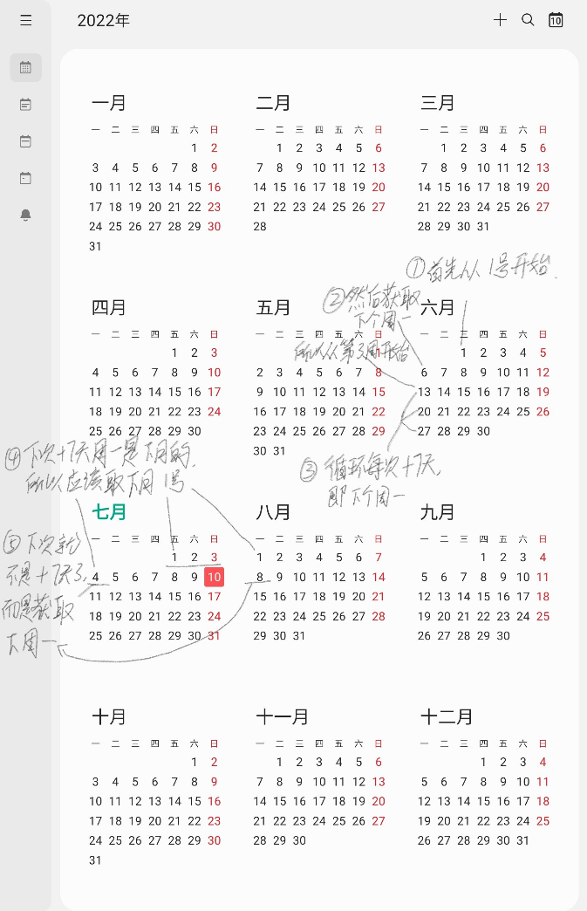
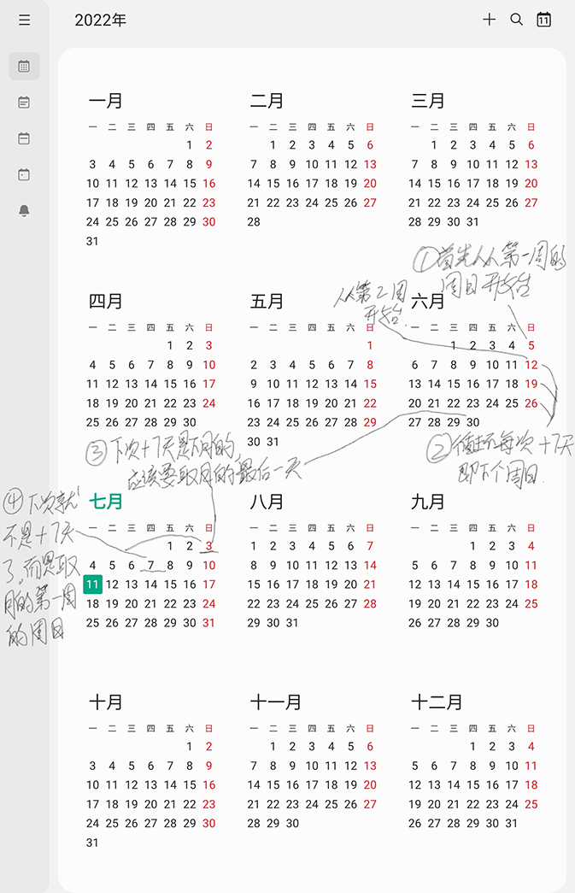

# DateUtil 时间工具类

继承`org.apache.commons.lang3.time.DateUtils`。

大量使用 Java 8 时间类型，即`LocalDate`、`LocalTime`、`LocalDateTime`、`ZonedDateTime`等。

## getStartDayOfWeekOfMonth 

## getEndDayOfWeekOfMonth

